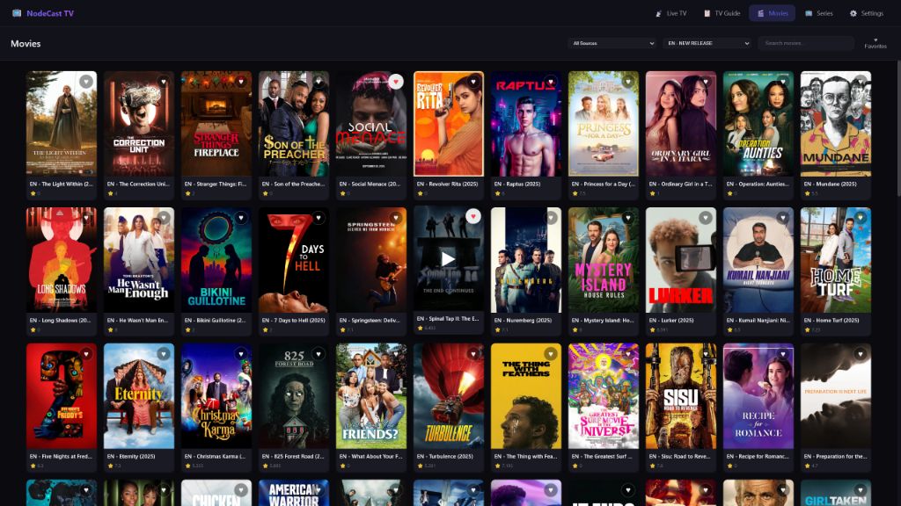
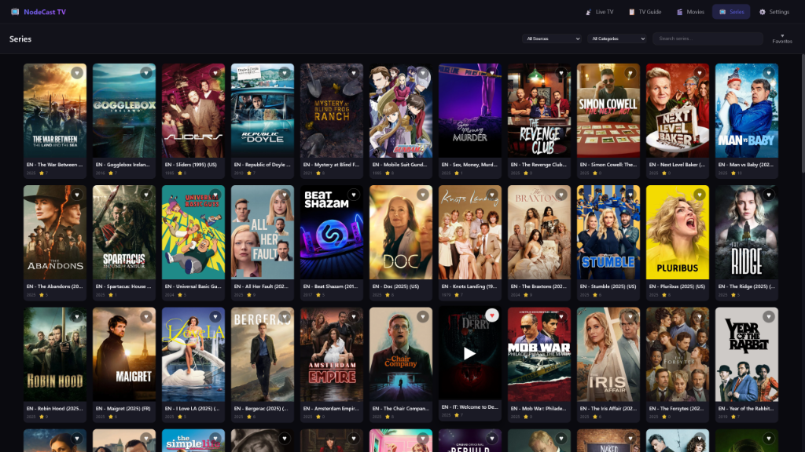

# NodeCast TV

A modern, web-based IPTV player featuring Live TV, EPG, Movies (VOD), and Series support. Built with performance and user experience in mind.

## Features

- **📺 Live TV**: Fast channel zapping, category grouping, and search.
- **📅 TV Guide (EPG)**: Interactive grid guide with 24h timeline, search, and dynamic resizing.
- **🎬 VOD Support**: Dedicated sections for Movies and TV Series with rich metadata, posters, and seasonal episode lists.
- **❤️ Favorites System**: Unified favorites for channels, movies, and series with instant synchronization.
- **⚡ High Performance**: Optimized for large playlists (7000+ channels) using virtual scrolling and batch rendering.
- **⚙️ Management**: 
  - Support for Xtream Codes and M3U playlists.
  - Manage hidden content categories.
  - Playback preferences (volume memory, auto-play).
- **🔊 Audio Transcoding**: Optional FFmpeg-based audio transcoding for Dolby/AC3/EAC3 compatibility.
- **🐳 Docker Ready**: Easy deployment containerization.

## Screenshots

<div align="center">
  
  
  
  
</div>

## Getting Started

### Prerequisites

- Node.js (v14 or higher)
- npm

### Installation

1.  Clone the repository:
    ```bash
    git clone https://github.com/yourusername/nodecast-tv.git
    cd nodecast-tv
    ```

2.  Install dependencies:
    ```bash
    npm install
    ```

3.  Start the development server:
    ```bash
    npm run dev
    ```

4.  Open your browser at `http://localhost:3000`.

### Docker Deployment

You can run NodeCast TV easily using Docker.

1.  Create a `docker-compose.yml` file (or copy the one from this repo):

    ```yaml
    services:
      nodecast-tv:
        build: https://github.com/technomancer702/nodecast-tv.git#main
        container_name: nodecast-tv
        ports:
          - "3000:3000" # Host:Container
        volumes:
          - ./data:/app/data
        restart: unless-stopped
        environment:
          - NODE_ENV=production
          - PORT=3000 # Optional: Internal container port
    ```

2.  Run the container:
    ```bash
    docker-compose up -d
    ```

The application will be available at `http://localhost:3000`.

### Usage

1.  Go to **Settings** -> **Content Sources**.
2.  Add your IPTV provider details (Xtream Codes or M3U URL).
3.  Click "Refresh Sources".
4.  Navigate to **Live TV**, **Movies**, or **Series** to browse your content.

## Browser Codec Support

NodeCast TV is a web-based application, which means **video decoding is handled by your browser**, not by the server. The server simply proxies the stream data - it does not transcode or re-encode video.

This means codec support depends entirely on what your browser can decode natively:

| Codec | Chrome | Firefox | Safari | Edge |
|-------|--------|---------|--------|------|
| **H.264 (AVC)** | ✅ | ✅ | ✅ | ✅ |
| **H.265 (HEVC)** | ❌¹ | ❌ | ✅ | ⚠️² |
| **VP9** | ✅ | ✅ | ⚠️³ | ✅ |
| **AV1** | ✅ | ✅ | ❌ | ✅ |
| **AAC Audio** | ✅ | ✅ | ✅ | ✅ |
| **AC3/EAC3 (Dolby)** | ❌ | ❌ | ✅ | ❌ |
| **MP3 Audio** | ✅ | ✅ | ✅ | ✅ |

**Notes:**
1. Chrome may support HEVC on macOS with hardware decoder
2. Edge requires the paid "HEVC Video Extensions" from Microsoft Store ($0.99)
3. Safari VP9 support varies by device/version

**If a stream doesn't play:**
- The stream codec may not be supported by your browser
- Try a different browser (Safari for HEVC/Dolby, Chrome/Edge for VP9/AV1)
- Check if your IPTV provider offers alternative stream formats
- For Dolby audio issues, enable **"Force Audio Transcode"** in Settings → Streaming

### Audio Transcoding

For streams with Dolby Digital (AC3/EAC3) audio that browsers can't decode natively:

1. Install FFmpeg support: `npm install ffmpeg-static` (included as optional dependency)
2. Enable **"Force Audio Transcode"** in Settings → Streaming
3. Audio will be transcoded to AAC while video passes through unchanged

**Note:** For ad-stitched live streams (like Pluto TV), transcoding may struggle to keep up. These streams typically use AAC audio already, so the built-in HLS discontinuity handling manages audio transitions without transcoding.

## Supported Stream Types

NodeCast TV is optimized for **HLS (HTTP Live Streaming)**.

-   **✅ HLS (`.m3u8`)**: Fully supported and recommended. Best for adaptive bitrate and network resilience.
-   **✅ MPEG-TS (`.ts`)**: Supported via Force Remux in settings.
-   **⚠️ High Latency/P2P**: For sources like Acestream, prefer HLS output (`.m3u8`) over raw TS streams to avoid timeouts during buffering.
-   **❌ RTMP/RTSP**: Not supported natively by browsers.

## Streaming Settings

All streaming settings are found in **Settings → Player → Streaming**.

| Setting | What It Does | When to Enable |
|---------|--------------|----------------|
| **Force Backend Proxy** | Routes streams through the NodeCast TV server, adding proper CORS headers | When streams fail with "Access-Control-Allow-Origin" errors, or when using IPTV middleware |
| **Force Audio Transcode** | Transcodes audio to AAC using FFmpeg (video passes through unchanged) | When you have video but no audio (Dolby/AC3/EAC3 streams) |
| **Force Remux** | Remuxes MPEG-TS to MP4 container using FFmpeg (no re-encoding, very lightweight) | When using raw `.ts` streams from m3u-editor, dispatcharr, or similar middleware |
| **Stream Output Format** | Controls whether Xtream API requests use HLS (.m3u8) or TS format | Try TS if you experience buffering issues with HLS |

## Troubleshooting

### Video Won't Play (Black Screen or Loading Forever)

| Symptom | Likely Cause | Solution |
|---------|--------------|----------|
| Black screen, `Access-Control-Allow-Origin` error | CORS blocked | Enable **"Force Backend Proxy"** in Settings → Streaming |
| Black screen with `MEDIA_ERR_DECODE` or `fragParsingError` | Unsupported codec (likely HEVC) | Try a different browser (see Codec Support table) |
| Loading forever (no error) | Decoder hung on unsupported codec | Try Safari or Edge; stream likely uses HEVC |

### No Audio (Video Plays Fine)

| Symptom | Likely Cause | Solution |
|---------|--------------|----------|
| No audio at all | Dolby/AC3/EAC3 audio | Enable **"Force Audio Transcode"** in Settings → Streaming |
| No audio on some channels | Codec mismatch | Try Safari (best Dolby support) or enable transcoding |
| Audio out of sync | Stream encoding issue | Try changing stream format to TS in Settings |

### Buffering Issues

| Symptom | Likely Cause | Solution |
|---------|--------------|----------|
| Constant buffering | Slow network or provider | Try TS format instead of HLS in Settings |

### HTTPS / Reverse Proxy Issues

If you're running NodeCast TV behind a reverse proxy (Nginx, Caddy, Traefik) with HTTPS:

| Symptom | Likely Cause | Solution |
|---------|--------------|----------|
| Streams fail with `fragLoadError` | Mixed content (HTTPS page loading HTTP streams) | Enable **"Force Backend Proxy"** in Settings → Streaming |
| Channel icons don't load | Mixed content on images | Icons are now automatically proxied on HTTPS - update to latest version |
| Streams work on HTTP but not HTTPS | Reverse proxy not passing headers correctly | Ensure `X-Forwarded-Proto` header is set (see examples below) |

**Caddy example:**
```
tv.domain.com {
    reverse_proxy nodecast:3000 {
        flush_interval -1
        header_up X-Forwarded-Proto {scheme}
    }
}
```

**Nginx example:**
```nginx
location / {
    proxy_pass http://nodecast:3000;
    proxy_buffering off;
    proxy_set_header Host $host;
    proxy_set_header X-Real-IP $remote_addr;
    proxy_set_header X-Forwarded-For $proxy_add_x_forwarded_for;
    proxy_set_header X-Forwarded-Proto $scheme;
}
```

### IPTV Middleware (m3u-editor, dispatcharr, Threadfin, etc.)

If you're using IPTV middleware like **m3u-editor**, **dispatcharr**, **Threadfin**, or **xTeVe** to manage your streams, you may need to adjust NodeCast TV settings for optimal playback. These tools typically use passthrough mode, which preserves original codecs (like HEVC/Dolby) that most browsers cannot decode natively, and may also trigger CORS restrictions.

**Recommended Settings in NodeCast TV:**

| Setting | Location | When to Enable |
|---------|----------|----------------|
| **Force Backend Proxy** | Settings → Player → Streaming | Always recommended when using middleware |
| **Force Remux** | Settings → Player → Streaming | For raw `.ts` streams (lightweight, no re-encoding) |
| **Force Audio Transcode** | Settings → Player → Streaming | If you have no audio (Dolby/AC3/EAC3 streams) |

---

#### m3u-editor (sparkison/m3u-editor)

m3u-editor includes an internal proxy that remuxes streams to MPEG-TS. 

**Setup:**
1. In m3u-editor, configure your playlist and enable the proxy if needed
2. In NodeCast TV, enable **"Force Remux"** in Settings → Streaming (for raw .ts streams)
3. If audio doesn't play, enable **"Force Audio Transcode"** instead

**Note:** m3u-editor's proxy preserves original codecs. If your source has HEVC or Dolby, you'll need transcoding or a compatible browser (Safari).

---

#### dispatcharr

dispatcharr uses FFmpeg stream profiles to process streams. By default it outputs MPEG-TS with passthrough codecs.

**Setup:**
1. In dispatcharr, streams are proxied by default via stream profiles
2. In NodeCast TV, enable **"Force Remux"** in Settings → Streaming (for raw .ts streams)
3. If audio doesn't play, enable **"Force Audio Transcode"** instead

**Custom dispatcharr profile for browser compatibility:**
If you want dispatcharr to transcode audio for you instead of NodeCast TV:
```
-user_agent {userAgent} -i {streamUrl} -c:v copy -c:a aac -f mpegts pipe:1
```
This keeps video passthrough but converts audio to AAC.

---

#### Threadfin / xTeVe

These HDHomeRun emulators work similarly to other middleware.

**Setup:**
1. Add your Threadfin/xTeVe M3U URL as an M3U source in NodeCast TV
2. Enable **"Force Remux"** in Settings → Streaming (for raw .ts streams)
3. If needed, enable **"Force Audio Transcode"** instead for Dolby audio

### TVHeadend

If you're using TVHeadend as your source, you may need to configure a few settings for streams to play correctly in NodeCast TV:

**Option 1: Enable Force Backend Proxy (Easiest)**
- In NodeCast TV, go to **Settings → Player → Streaming**
- Enable **"Force Backend Proxy"**
- This routes streams through the server, bypassing browser CORS restrictions

**Option 2: Configure TVHeadend CORS**
- In TVHeadend, go to **Configuration → General → Base → HTTP Server Settings**
- Add your NodeCast TV URL to **"CORS origin"** (e.g., `http://192.168.1.100:3000`)
- **Note:** You must include the protocol (`http://` or `https://`)

**Additional Tips:**
- Enable **"digest+plain"** authentication in TVHeadend if using username/password in the M3U URL
- Try different stream profiles (`?profile=pass` or `?profile=matroska`) if playback issues persist

### Acestream / P2P Streaming

If you are using `acestream-docker-home` or similar tools, you **MUST** use the HLS output format.

-   **Don't use**: `http://proxy:6878/ace/getstream?id=...` (This is a raw MPEG-TS stream)
-   **Do use**: `http://proxy:6878/ace/manifest.m3u8?id=...` (This wraps the stream in a browser-friendly HLS playlist)

## Technology Stack

- **Backend**: Node.js, Express
- **Frontend**: Vanilla JavaScript (ES6+), CSS3
- **Database**: JSON-based local storage (LowDB style)
- **Streaming**: HLS.js for stream playback
- **Audio Transcoding**: FFmpeg (optional, via ffmpeg-static)

## Project Structure

```
nodecast-tv/
├── public/              # Frontend assets
│   ├── css/             # Stylesheets
│   ├── js/              # Client-side logic
│   │   ├── components/  # UI Components (ChannelList, EpgGuide, etc.)
│   │   ├── pages/       # Page Controllers (Movies, Series, etc.)
│   │   └── api.js       # API Client
│   └── index.html       # Main entry point
├── server/              # Backend server
│   ├── routes/          # API Endpoints (proxy, transcode)
│   ├── services/        # Playlist parsers & logic
│   └── db.js            # Data persistence layer
└── data/                # Persistent storage (playlists, settings)
```

## License

This project is licensed under the **GNU General Public License v3.0 (GPL-3.0)**.

You are free to:
-   **Run** the program for any purpose
-   **Study** how the program works and change it
-   **Redistribute** copies
-   **Distribute** copies of your modified versions

Under the condition that:
-   You typically must distinguish your modifications from the original work
-   You provide the source code to recipients
-   You license any derivative works under the same GPL-3.0 license

See the [LICENSE](LICENSE) file for details.
